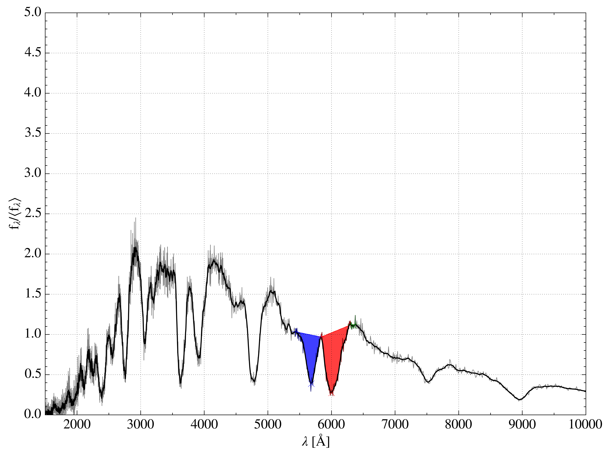

# tardisanalysis

This repository is a loose collection of python tools and scripts to diagnose
Tardis calculations. These tools are typically designed to post-process Tardis
models. If you have designed a useful script to examine Tardis runs and want to
contribute, please contact @wkerzendorf or @unoebauer.

## Instructions

A brief description on the different tools and how to use them may be found
[here](docu/instructions.md).

## Examples

The following examples illustrate the capabilities of some of the scripts
currently in the repository.

* generating detailed as spectral synthesis plots as suggested by M. Kromer
  with ``tardis_kromer_plot.py``:

* calculating and examining the opacity within a Tardis calculation in detail
  with ``tardis_opacity.py``:

* computing pseudo equivalent widths (pEW), depths and velocities of spectral features
  with ``compute_features.py``: (Note, requires PyAstronomy for extinction corrections.)

