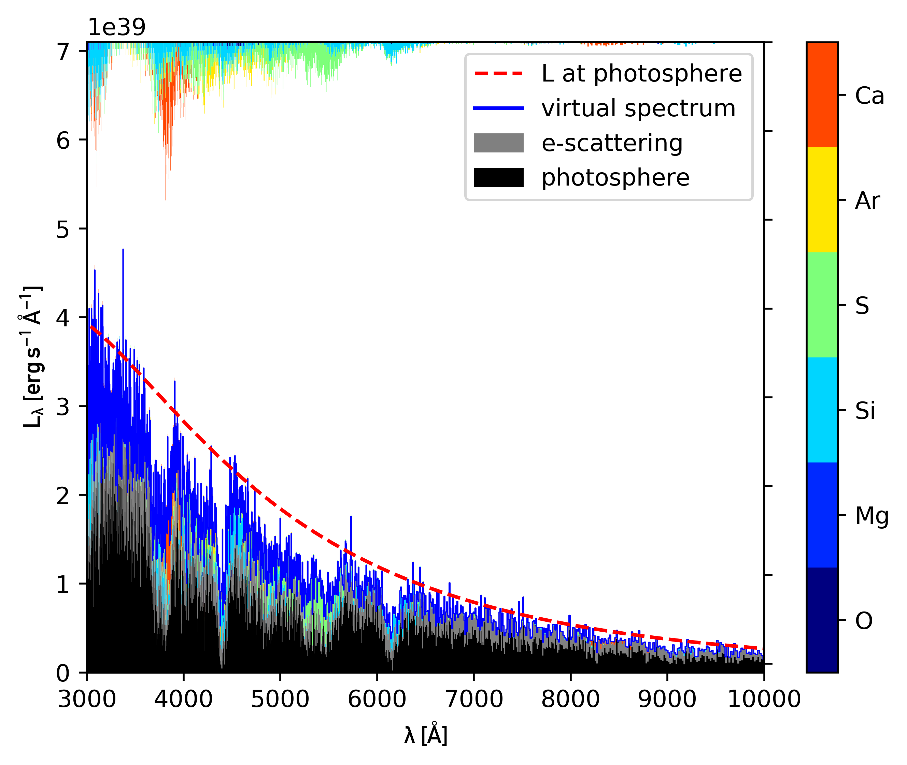

# Instructions

in the following, brief instructions on how to use the tools of the repository
are provided.

## tardis_opacity.py

With ``tardis_opacity.py``, the opacity within a Tardis model may be examined in
detail. To determine the line opacity, the expansion opacity formalism is used.

The following figure shows the total opacity in the first and last radial shell
in the Tardis calculation using the ``tardis_example`` setup:


It has been produced with the following instructions (some plotting related
instructions are omitted):

```
import tardis
import tardis_opacity as top

config = tardis.yaml_load("tardis_example.yml")
mdl = tardis.run_tardis(config)

# initialise opacity calculator
opacity_diag = top.opacity_calculator(mdl)
# get total opacity on a standard frequency grid for each cell
chi_tot = opacity_diag.kappa_tot
# midpoints of the frequency grid:
nu_grid = 0.5 * (opacity_diag.nu_bins[1:] + opacity_diag.nu_bins[:-1])

plt.loglog(nu_grid, chi_tot[:, 0], label = "cell #0")
plt.loglog(nu_grid, chi_tot[:, -1], label = "cell #19")
```

With the opacity_calculator, the following quantities may also be calculated:

* pure bound-bound opacity per shell
* pure Thomson opacity per shell
* Planck-mean opacity per shell
* Planck-mean optical depth of each shell
* Planck-mean optical depth, integrated from the ejecta surface

## tardis_kromer_plot.py

With ``tardis_kromer_plot.py``, the importance of the different chemical
elements for the formation of the synthetic spectra may be illustrated. This
type of illustration has been developed by M. Kromer.

**Important:** The virtual packet logging capability must be active in order to
use this tool to generate Kromer plots from the virtual packet population.
Thus, Tardis must be compiled with the flag ``--with-vpacket-logging``.

The following figure shows such a "Kromer-type" plot for a Tardis calculation
using the ``tardis_example`` setup:


It has been produced with the following instructions:

```
import tardis
import tardis_kromer_plot as tkp
import tardis_minimal_model as tmm

config = tardis.yaml_load("tardis_example.yml")
mdl = tardis.run_tardis(config)
minmodel = tmm.minimal_model(mode="virtual")
minmodel.from_interactive(mdl)


# initialise the plotting tool
plotter = tkp.tardis_kromer_plotter(minmodel, mode="virtual")
# generate plot
plotter.generate_plot(xlim=(3000,1e4), twinx=True)
```

A Kromer-type plot for the real packet population may be generated analogously
by replacing ``mode='virtual'`` with ``mode='real'`` in the above example.:



## compute_features.py

With ``compute_features.py``, one can compute the pEW, depth and velocity
of selected spectral features. The routine that define the features and
the calculations are based on [Silverman+ 2012](http://adsabs.harvard.edu/abs/2012MNRAS.425.1819S).
Uncertainties are computed with a simple Monte Carlo routine based on [Liu+ 2016](http://adsabs.harvard.edu/abs/2016ApJ...827...90L).

**Important:** To run compute_features.py, the PyAstronomy package
has to be installed in the same environment as tardis.
Currently using PyAstronomy v11.0, which can be found [here](http://www.hs.uni-hamburg.de/DE/Ins/Per/Czesla/PyA/PyA/index.html).


```
import tardis
import compute_features as cp

sim = tardis.run_tardis('./docu/inputs/loglum-8.538.yml',
                        './docu/inputs/kurucz_cd23_chianti_H_He.h5') 

#Get wavelength and flux values as arrays.
wavelength = sim.runner.spectrum_virtual.wavelength[::-1].value
flux = sim.runner.spectrum_virtual.luminosity_density_lambda[::-1].value

#Compute features
D = cp.Analyse_Spectra(wavelength=wavelength, flux=flux,
  redshift=0., extinction=-0.014, smoothing_window=17).run_analysis()

#Compute corresponding uncertainties.
D = cp.Compute_Uncertainty(D=D, smoothing_window=17,
                           N_MC_runs=1000).run_uncertainties()

#Make spectrum plot where features are highlighted.
cp.Plot_Spectra(D, './docu/images/example_spectrum.png',
                show_fig=True, save_fig=True)
                
print 'pEW of main Si feature (f7) = ', D['pEW_f7'], '+-', D['pEW_unc_f7']
print 'Velocity of weak Si feature (f6) = ', D['velocity_f6'], '+-',\
      D['velocity_unc_f6']
```

## tardis_line_id.py

With ``tardis_line_id.py``, one can determine the transition(s) that are
influencing the spectrum most, within a user-specified range.

The following figure shows such an example bar chart for a Tardis calculation
using the ``tardis_example`` setup:


It has been produced with the following instructions:

```
import tardis
import tardis_minimal_model as tmm
import tardis_line_id as tlid

config = tardis.yaml_load("model_late.yml")
mdl = tardis.run_tardis(config)
minmodel = tmm.minimal_model(mode="virtual")
minmodel.from_interactive(mdl)

# initialise the plotting tool
plotter = tlid.line_identifier(minmodel)
# generate plot
plotter.plot_summary(lam_min=4000, lam_max=7000, nlines=20, output_filename='output_barchart_info.txt')
```


